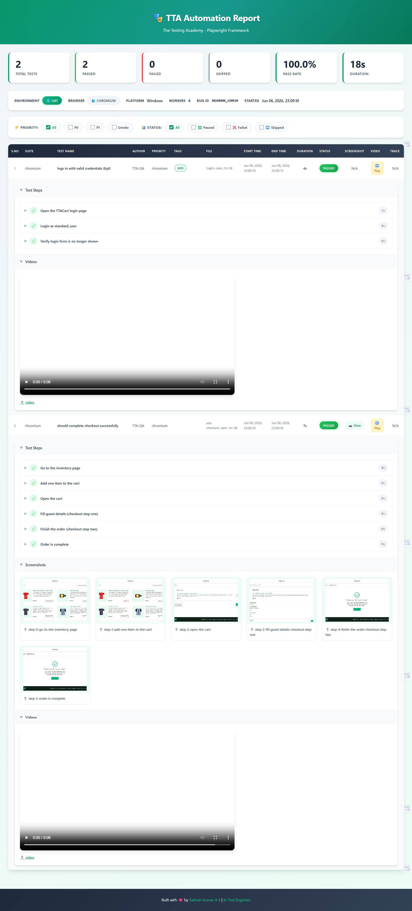
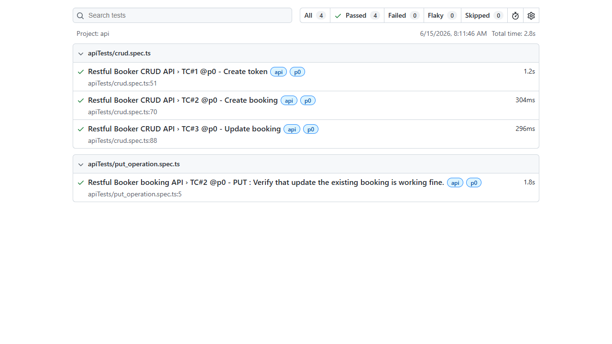
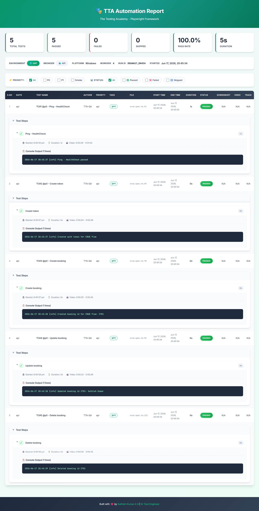
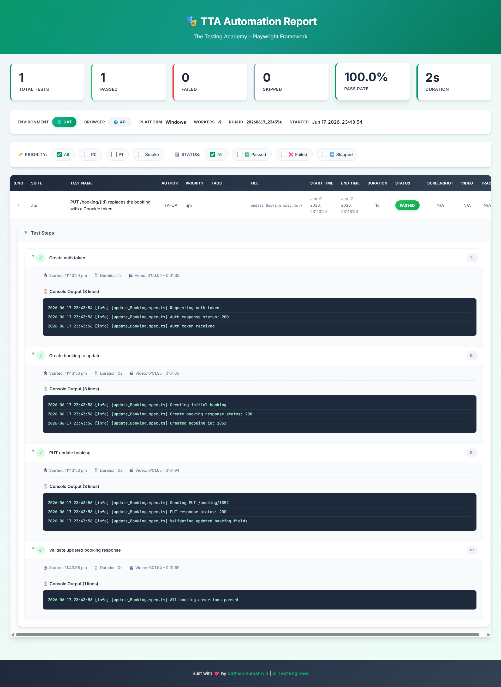
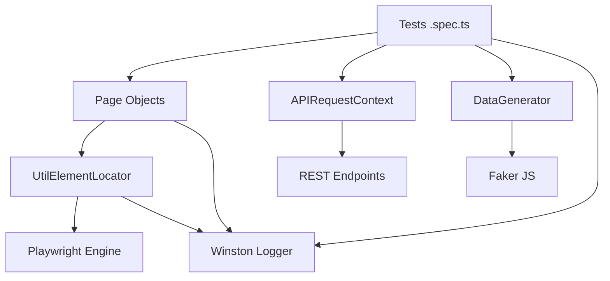
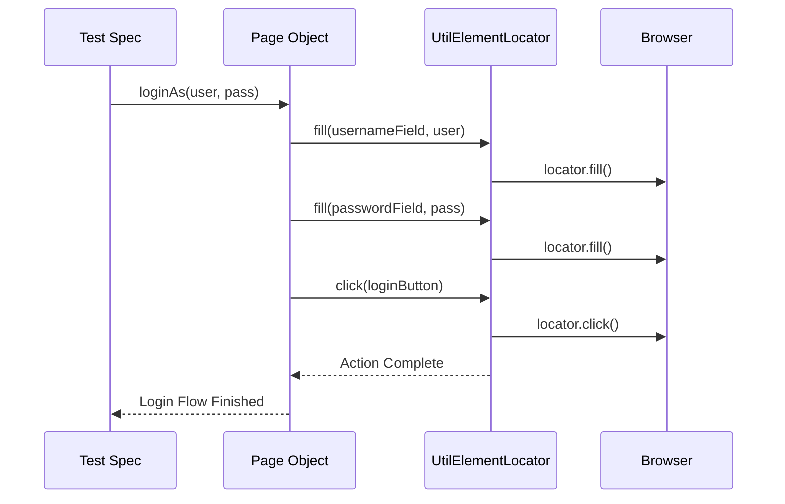
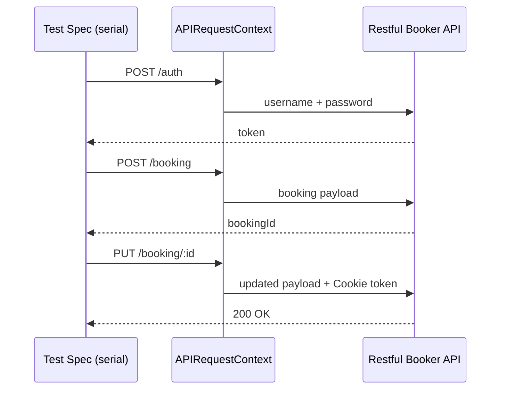
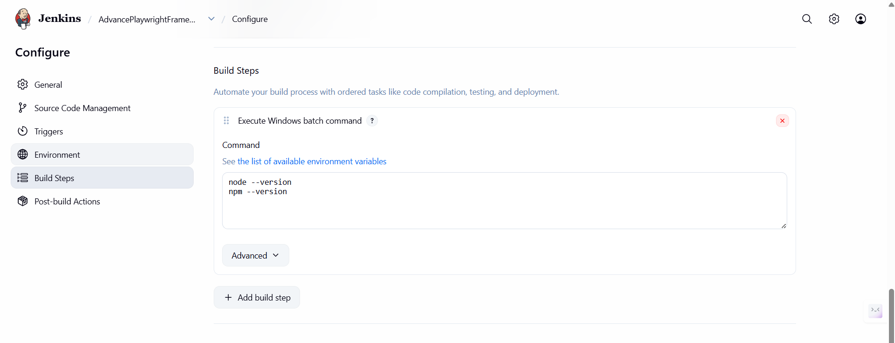
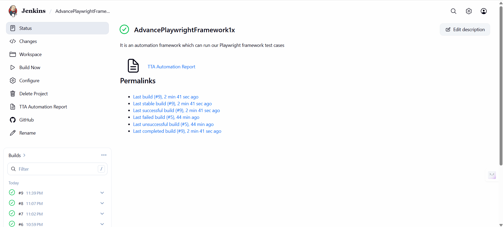
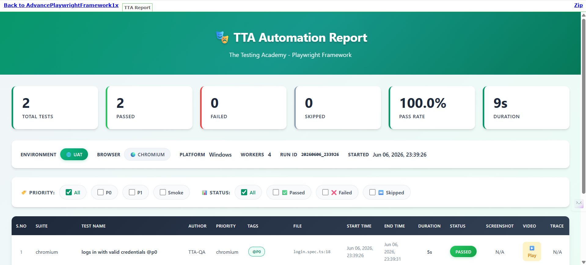

# Advance Playwright Framework (1.x)

> Production-grade Playwright + TypeScript automation framework built by [Pramod Dutta](https://thetestingacademy.com) for **The Testing Academy**.

[](https://playwright.dev)
[](https://www.typescriptlang.org)
[](https://nodejs.org)
[]()

A complete, opinionated, batteries-included Playwright framework with **Page Object Model**, **fixtures**, **data-driven testing**, **multi-env config**, **API testing**, **Winston logging**, a **custom HTML reporter**, **Allure**, and **CI-ready scripts**.

---

## Table of Contents

- [Features](#features)
- [Folder Structure](#folder-structure)
- [Quick Start](#quick-start)
- [NPM Scripts](#npm-scripts)
- [Path Aliases](#path-aliases)
- [Environment Configuration](#environment-configuration)
- [Test Tags & Filtering](#test-tags--filtering)
- [API Testing](#api-testing)
- [Logging (Winston)](#logging-winston)
- [Reporting](#reporting)
- [Framework Architecture](#framework-architecture)
- [AI Agent Rules](#ai-agent-rules)
- [Project Rules](#project-rules)
- [CI/CD Integration (Jenkins)](#cicd-integration-jenkins)
- [Phase 1 Walkthrough](#phase-1-walkthrough)
- [Contributing](#contributing)
- [Author](#author)

---

## Features

- **Playwright Test runner** — parallel, retries, projects, trace viewer
- **TypeScript strict mode** with path aliases (`@pages`, `@utils`, `@api`, …)
- **Page Object Model** under `src/pages/` — 8 page classes covering full e-commerce checkout flow
- **Custom Fixtures** under `src/fixtures/` — avoids manual POM instantiation in specs
- **Centralized Config** under `src/config/` — manages environment credentials
- **API Testing** — dedicated `apiTests/` suite using Playwright `APIRequestContext` (CRUD + PUT flows)
- **Visual Step Utility** under `src/utils/visualStep.ts` — automatic screenshots for TTA reports
- **Util Element Locator** under `src/utils/UtilElementLocator.ts` — consistent timeouts + integrated logging
- **Data Generator** under `src/utils/DataGenerator.ts` — dynamic test data via `@faker-js/faker`
- **Multi-env config** via `dotenv` — qa, stg, prod, dev, api
- **Data-driven testing** — CSV (`csv-parse`), JSON, XLSX (`xlsx`)
- **Winston logger** with file + console + rotation
- **Custom TTA HTML Reporter** (`CustomTTAReporter.ts`) — branded, real-time with screenshots + video
- **Allure** reporter integration with environment info + failure categories
- **Tag-based execution** — `@p0`, `@p1`, `@e2e`, `@smoke`, `@lor`
- **Cross-browser** — Chromium, Firefox, WebKit, Mobile Chrome (Pixel 5)
- **Dual Playwright projects** — `api` project (headless REST) + `chromium` project (UI)
- **CI-aware config** — auto-tunes retries, workers, `forbidOnly`
- **AI-agent rule files** for Claude Code, Copilot, Cursor, Windsurf, Augment, Antigravity, Aider, Codex, Jules
- **ESLint + Prettier + tsc** quality gates enforced on every test change
- **Docker-ready** (Dockerfile placeholder)

---

## Folder Structure

```
AdvancePlaywrightFramework1x/
├── src/
│   ├── api/                   # API clients (REST / GraphQL)
│   ├── config/                # Env loaders, constants, URLs
│   ├── fixtures/
│   │   └── test-base.ts       # Custom Playwright fixtures
│   ├── pages/                 # Page Object Model classes
│   │   ├── BasePage.ts        # Base class all pages extend
│   │   ├── LoginPage.ts
│   │   ├── InventoryPage.ts
│   │   ├── ItemDetailPage.ts
│   │   ├── CartPage.ts
│   │   ├── CheckoutStepOnePage.ts
│   │   ├── CheckoutStepTwoPage.ts
│   │   ├── CheckoutCompletePage.ts
│   │   └── index.ts           # Barrel export
│   ├── testdata/              # CSV / JSON / XLSX test data
│   ├── tests/
│   │   ├── apiTests/          # REST API test specs
│   │   │   ├── 01_restfulbooker_raw/     # Level 1 — raw APIRequestContext
│   │   │   │   ├── basic_Ping.spec.ts        # Simple GET health-check against /ping
│   │   │   │   ├── curd_operation.spec.ts    # GET ping with full status + body assertion
│   │   │   │   ├── post_operation.spec.ts    # POST booking flow with auth + test.step()
│   │   │   │   ├── newContext_api.spec.ts    # Isolated context via request.newContext()
│   │   │   │   ├── crud.spec.ts              # Serial CRUD flow (auth → create → update)
│   │   │   │   └── put_operation.spec.ts     # PUT operation standalone test
│   │   │   └── 02_restfulbooker_apiHelper/  # Level 2 — ApiHelper abstraction layer
│   │   │       ├── create_Booking.spec.ts    # POST booking via ApiHelper + test.step()
│   │   │       └── update_Booking.spec.ts    # PUT booking via ApiHelper + Cookie token
│   │   ├── e2e/               # End-to-end UI specs
│   │   │   └── e2e-checkout.spec.ts  # Full checkout journey
│   │   └── tests/             # Unit / integration specs
│   │       ├── login.spec.ts
│   │       └── example.spec.ts
│   └── utils/                 # Helpers
│       ├── logger.ts              # Winston logger
│       ├── CustomTTAReporter.ts   # TTA HTML reporter
│       ├── UtilElementLocator.ts  # Playwright locator wrapper
│       ├── DataGenerator.ts       # Faker-based test data factory
│       └── visualStep.ts          # Auto-screenshot step utility
│
├── docs/
│   └── images/                # Screenshots and docs assets
│
├── rules/                     # Canonical project rules
│   ├── README.md
│   └── test-quality-checks.md
│
├── logs/                      # Winston log output (gitignored)
├── allure-results/            # Allure raw results (gitignored)
├── allure-report/             # Allure HTML (gitignored)
├── playwright-report/         # Playwright HTML (gitignored)
├── test-results/              # Playwright test artifacts (gitignored)
├── tta-report/                # Custom TTA HTML reports (gitignored)
│
├── .github/
│   ├── copilot-instructions.md
│   └── workflows/             # GitHub Actions CI
│
├── .claude/                   # Claude Code config
├── .cursor/rules/             # Cursor MDC rules
├── .windsurf/rules/           # Windsurf rules
├── .augment/rules/            # Augment Code rules
│
├── .cursorrules               # Cursor legacy
├── .windsurfrules             # Windsurf legacy
├── .augment-guidelines        # Augment legacy
├── AGENTS.md                  # Antigravity / Codex / Aider / Jules
├── CLAUDE.md                  # Claude Code project rules
│
├── .env                       # Local env (gitignored)
├── .gitignore
├── Dockerfile
├── playwright.config.ts       # Playwright configuration
├── tsconfig.json              # TypeScript config + path aliases
├── package.json
├── package-lock.json
└── README.md
```

---

## Latest Execution Report

TTA custom HTML reporter generates a branded report after every run, showing test steps, screenshots, and video recordings inline.



- **100% pass rate** — 2/2 tests passed in 18s
- **Inline screenshots** per step for the checkout flow
- **Embedded video** recordings for every test
- **Step-level timing** — start time, end time, duration per test step
- **Report location:** `tta-report/index.html`

---

## Quick Start

### Prerequisites

- Node.js **18+**
- npm 9+
- (Optional) Allure CLI: `brew install allure` / `scoop install allure`

### Install

```bash
git clone https://github.com/PramodDutta/AdvancePlaywrightFramework1x.git
cd AdvancePlaywrightFramework1x
npm install
npx playwright install --with-deps
```

### Run tests

```bash
npm test                          # all tests, all projects
npm run test:chromium             # UI tests on chromium only
npm run test:ui                   # UI mode (debug-friendly)
npm run test:p0                   # smoke / critical only

# API tests
npx playwright test --project=api
TTA_ENV=api npx playwright test --project=api
```

### View report

```bash
npm run test:report       # Playwright HTML
npm run test:allure       # Allure HTML
# TTA custom report auto-generated at tta-report/index.html
```

---

## NPM Scripts

| Script | Purpose |
|--------|---------|
| `test` | Run all tests, all projects |
| `test:headed` | Run with browser visible |
| `test:ui` | Playwright UI mode |
| `test:chromium` / `test:firefox` / `test:webkit` | Per-browser run |
| `test:debug` | Playwright Inspector |
| `test:e2e` | Tag `@e2e` |
| `test:p0` / `test:p1` | Priority-tagged runs |
| `test:lor` | Tag `@lor` (Lord of the Rings test suite 😉) |
| `test:report` | Open Playwright HTML report |
| `test:report:ci` | Serve report on `0.0.0.0:9323` for CI |
| `test:allure` | Generate + open Allure HTML |
| `lint` / `lint:fix` | ESLint check / fix |
| `typecheck` | `tsc --noEmit` |
| `format` / `format:check` | Prettier |
| `build` | `tsc` compile |
| `clean` | Wipe reports, results, cache |

---

## Path Aliases

Defined in `tsconfig.json`:

| Alias | Resolves to |
|-------|------------|
| `@api/*` | `src/api/*` |
| `@config/*` | `src/config/*` |
| `@fixtures/*` | `src/fixtures/*` |
| `@pages/*` | `src/pages/*` |
| `@testdata/*` | `src/testdata/*` |
| `@tests/*` | `src/tests/*` |
| `@utils/*` | `src/utils/*` |

Example:
```ts
import logger from '@utils/logger';
import { LoginPage } from '@pages/LoginPage';
import { users } from '@testdata/users.json';
```

---

## Environment Configuration

`.env` (root) — loaded by `dotenv` in `playwright.config.ts`.

Supported keys:

```dotenv
TTA_ENV=qa                # qa | stg | prod | dev | api
BASE_URL=                 # override everything if set
QA_BASE_URL=https://app.thetestingacademy.com
STG_BASE_URL=https://stage.thetestingacademy.com
PROD_BASE_URL=https://app.thetestingacademy.com
DEV_BASE_URL=http://localhost:3000
API_BASE_URL=https://restful-booker.herokuapp.com
LOG_LEVEL=info            # winston log level
TEST_ENV=UAT              # shown in TTA report
TEST_AUTHOR=Pramod
```

Switch env:
```bash
TTA_ENV=stg npm test
TTA_ENV=api npx playwright test --project=api
```

---

## Test Tags & Filtering

Tag your tests:

```ts
test('login with valid creds @p0 @smoke @e2e', async ({ page }) => { ... });
```

Filter:

```bash
npm run test:p0           # @p0 only
npm run test:e2e          # @e2e only
npx playwright test --grep "@smoke"
npx playwright test --grep-invert "@flaky"
```

---

## API Testing

The framework includes a dedicated API testing suite under `src/tests/apiTests/` using Playwright's built-in `APIRequestContext`. Tests target the [Restful Booker](https://restful-booker.herokuapp.com) API.

### Test Suites

**Level 1 — `01_restfulbooker_raw/` (raw `APIRequestContext`)**

| File | Description |
|------|-------------|
| `basic_Ping.spec.ts` | Simple GET `/ping` health-check — validates HTTP 201 response |
| `curd_operation.spec.ts` | GET `/ping` with full assertion — status code + body text check |
| `post_operation.spec.ts` | POST booking flow — auth token → create booking via `test.step()` |
| `newContext_api.spec.ts` | Isolated API context via `request.newContext()` — custom headers, gorest.in |
| `crud.spec.ts` | Serial CRUD flow — auth token → create booking → update booking |
| `put_operation.spec.ts` | Standalone PUT test — self-contained auth + create + update |

**Level 2 — `02_restfulbooker_apiHelper/` (`ApiHelper` abstraction)**

| File | Description |
|------|-------------|
| `create_Booking.spec.ts` | POST `/booking` via `ApiHelper` — payload → response validation via `test.step()` |
| `update_Booking.spec.ts` | PUT `/booking/{id}` via `ApiHelper` — auth → create → update → validate via `test.step()` |

### Playwright Config — `api` Project

The `playwright.config.ts` defines a dedicated `api` project that targets only API specs:

```ts
projects: [
  { name: 'api', testMatch: /src\/tests\/apiTests\/.*\.spec\.ts/ },
  { name: 'chromium', testIgnore: /src\/tests\/apiTests\/.*\.spec\.ts/, use: { ...devices['Desktop Chrome'] } },
]
```

### Run API tests

```bash
# All API tests
npx playwright test --project=api

# With API env resolved automatically
TTA_ENV=api npx playwright test --project=api

# Specific file
npx playwright test src/tests/apiTests/crud.spec.ts --project=api
```

### CRUD Flow Example

```ts
test.describe.serial('Restful Booker CRUD API', () => {
  const bookingFlowState: BookingFlowState = {};

  test('TC#1 @p0 - Create token', async ({ request }) => { ... });
  test('TC#2 @p0 - Create booking', async ({ request }) => { ... });
  test('TC#3 @p0 - Update booking', async ({ request }) => { ... });
});
```

`test.describe.serial` ensures shared state (`bookingFlowState`) flows across dependent tests in order.

### Latest API Test Run



- **4/4 passed** — `crud.spec.ts` (3 tests) + `put_operation.spec.ts` (1 test)
- **Total time: 2.8s** — Project: `api`
- **Run date:** 15 June 2026, 08:11 AM

### CRUD Operations — TTA Report

TTA custom HTML reporter captures every API test step, request/response details, and step-level timing.



- **Full CRUD coverage** — auth token → POST booking → PUT update in serial flow
- **Step-level breakdown** — each `test.step()` recorded with start time, end time, and duration
- **Report location:** `tta-report/index.html`
- **Run date:** 17 June 2026, 09:20 PM

### Level 2 ApiHelper — PUT Update Booking TTA Report

`update_Booking.spec.ts` refactored with `ApiHelper` abstraction and 4 discrete `test.step()` blocks — all steps visible in TTA report with console log output per step.



- **1/1 passed** — `update_Booking.spec.ts` via `ApiHelper` layer
- **4 steps:** Create auth token (1309ms) → Create booking to update (296ms) → PUT update booking (296ms) → Validate updated booking response (8ms)
- **Total duration:** 2s | **Pass rate:** 100%
- **Run date:** 17 June 2026, 11:43 PM

---

## Logging (Winston)

```ts
import logger from '@utils/logger';

logger.info('login start', { user: 'pramod' });
logger.warn('slow API response', { ms: 3200 });
logger.error('test failed', new Error('boom'));
logger.debug('payload %o', { id: 1 });
```

Output:
- Console — colorized, timestamped
- `logs/error.log` — errors only (JSON, 5MB rotation × 5)
- `logs/combined.log` — everything (JSON, 5MB rotation × 5)

---

## Reporting

| Reporter | Output | Trigger |
|----------|--------|---------|
| Custom TTA | `tta-report/index.html` | auto every run |
| Playwright HTML | `playwright-report/` | auto; `npm run test:report` |
| JSON | `test-results/results.json` | auto |
| Allure | `allure-results/` → `allure-report/` | `npm run test:allure` |
| List (console) | stdout | auto |

**Allure config** includes environment info (env name, base URL, Node version, OS, CI flag) and pre-wired failure categories: assertion failures, broken tests, and timeouts.

---

## Framework Architecture

### High-Level Flow



### Component Breakdown

1. **Tests (`src/tests/`)**: Define the "what". Organized into `e2e/`, `apiTests/`, and `tests/` subdirectories.
2. **Page Objects (`src/pages/`)**: Define the "where". 8 page classes covering login → inventory → cart → checkout → complete.
3. **UtilElementLocator (`src/utils/UtilElementLocator.ts`)**: The "how". Wraps Playwright `Locator` with consistent timeouts and integrated logging.
4. **DataGenerator (`src/utils/DataGenerator.ts`)**: Dynamic, realistic test data via `@faker-js/faker`.
5. **Logger (`src/utils/logger.ts`)**: Scoped logging (e.g., `[LoginPage] clicked login button`) for easier debugging.
6. **CustomTTAReporter (`src/utils/CustomTTAReporter.ts`)**: TTA-branded HTML report with inline screenshots and video per test.

### Interaction Sequence — UI Login



### Interaction Sequence — API CRUD



---

## AI Agent Rules

This repo ships rules for every major AI coding assistant:

| Tool | File |
|------|------|
| Claude Code | [`CLAUDE.md`](./CLAUDE.md) |
| GitHub Copilot | [`.github/copilot-instructions.md`](./.github/copilot-instructions.md) |
| Cursor | [`.cursorrules`](./.cursorrules), [`.cursor/rules/`](./.cursor/rules/) |
| Windsurf | [`.windsurfrules`](./.windsurfrules), [`.windsurf/rules/`](./.windsurf/rules/) |
| Augment Code | [`.augment-guidelines`](./.augment-guidelines), [`.augment/rules/`](./.augment/rules/) |
| Antigravity / Codex / Aider / Jules | [`AGENTS.md`](./AGENTS.md) |

All enforce the same rule: **`npm run typecheck && npm run lint`** after every test change.

---

## Project Rules

Canonical source: [`rules/`](./rules/).

| Rule | When it applies |
|------|-----------------|
| [test-quality-checks.md](./rules/test-quality-checks.md) | Any change under `src/tests/**` |

---

## CI/CD Integration (Jenkins)

The framework is configured for execution on local Jenkins instances.

### Setup Steps

1. **Install Node.js**: Install Node.js on Jenkins and map the latest version in **Global Tool Configuration**.
2. **Build Step**: Use `Execute Windows batch command`:

```batch
set CI=true
set STANDARD_USER=standard_user
set TTA_SECRET=tta_secret
call npm ci --audit=false
call npx playwright install chromium
call npx playwright test src/tests/e2e/e2e-checkout.spec.ts src/tests/tests/login.spec.ts --project=chromium
```

3. **Run API tests in CI**:

```batch
set CI=true
call npm ci --audit=false
call npx playwright test --project=api
```

4. **CSS Fix for Reports**: Add this system property to Jenkins so reports display correctly:
   `System.setProperty("hudson.model.DirectoryBrowserSupport.CSP", "sandbox allow-scripts allow-same-origin; default-src 'self'; style-src 'self' 'unsafe-inline'; script-src 'self' 'unsafe-inline' 'unsafe-eval'; img-src 'self' data;;")`

### Jenkins Build Screenshots







---

## Phase 1 Walkthrough

Full prompt-by-prompt build log for Phase 1 lives at [`docs/phase1/prompts.md`](./docs/phase1/prompts.md). Replay every step to recreate the framework from scratch.

---

## Contributing

1. Fork
2. Branch (`git checkout -b feat/my-thing`)
3. Add tests + `npm run typecheck && npm run lint`
4. Commit + push
5. Open PR

---

## Author

**Pramod Dutta** — Founder, [The Testing Academy](https://thetestingacademy.com)

- YouTube: [@thetestingacademy](https://youtube.com/@thetestingacademy)
- LinkedIn: [pramoddutta](https://www.linkedin.com/in/pramoddutta/)
- Website: [thetestingacademy.com](https://thetestingacademy.com)

---

## License

ISC © Pramod Dutta / The Testing Academy
