# Advance Playwright Framework (1.x)

> Production-grade Playwright + TypeScript automation framework built by **Sathish Kumar A S** for **The Testing Academy**.

[](https://playwright.dev)
[](https://www.typescriptlang.org)
[](https://nodejs.org)
[](https://cucumber.io)
[]()

A complete, opinionated, batteries-included Playwright framework with **Page Object Model**, **fixtures**, **data-driven testing**, **multi-env config**, **API testing**, **Winston logging**, a **custom HTML reporter**, **Allure**, and **CI-ready scripts**.

---

## Table of Contents

- [Features](#features)
- [Folder Structure](#folder-structure)
- [Quick Start](#quick-start)
- [NPM Scripts](#npm-scripts)
- [Path Aliases](#path-aliases)
- [Environment Configuration](#environment-configuration)
- [Test Tags & Filtering](#test-tags--filtering)
- [API Testing](#api-testing)
- [Cucumber BDD Layer](#cucumber-bdd-layer)
- [Logging (Winston)](#logging-winston)
- [Reporting](#reporting)
- [Framework Architecture](#framework-architecture)
- [AI Agent Rules](#ai-agent-rules)
- [AI Layer](#ai-layer)
- [Project Rules](#project-rules)
- [CI/CD Integration (Jenkins)](#cicd-integration-jenkins)
- [Phase 1 Walkthrough](#phase-1-walkthrough)
- [Contributing](#contributing)
- [Author](#author)

---

## Features

- **Playwright Test runner** — parallel, retries, projects, trace viewer
- **TypeScript strict mode** with path aliases (`@pages`, `@utils`, `@api`, …)
- **Page Object Model** under `src/pages/` — 8 page classes covering full e-commerce checkout flow
- **Custom Fixtures** under `src/fixtures/` — avoids manual POM instantiation in specs
- **Centralized Config** under `src/config/` — manages environment credentials
- **API Testing** — dedicated `apiTests/` suite using Playwright `APIRequestContext` (CRUD, fixtures, JSONPath, AJV schema validation)
- **Visual Step Utility** under `src/utils/visualStep.ts` — automatic screenshots for TTA reports
- **Util Element Locator** under `src/utils/UtilElementLocator.ts` — consistent timeouts + integrated logging
- **Data Generator** under `src/utils/DataGenerator.ts` — dynamic test data via `@faker-js/faker`
- **Multi-env config** via `dotenv` — qa, stg, prod, dev, api
- **Data-driven testing** — CSV (`csv-parse`), JSON, XLSX (`xlsx`)
- **Winston logger** with file + console + rotation
- **Custom TTA HTML Reporter** (`CustomTTAReporter.ts`) — branded, real-time with screenshots + video
- **Allure** reporter integration with environment info + failure categories
- **Tag-based execution** — `@p0`, `@p1`, `@e2e`, `@smoke`, `@lor`
- **Cross-browser** — Chromium, Firefox, WebKit, Mobile Chrome (Pixel 5)
- **Dual Playwright projects** — `api` project (headless REST) + `chromium` project (UI)
- **`jsonpath-plus`** — query live API responses with dot-notation, wildcards, recursive descent, and filter expressions
- **Ajv schema validation** — JSON Schema contracts for every Restful Booker endpoint (POST, GET, PUT, PATCH, DELETE, ping)
- **CI-aware config** — auto-tunes retries, workers, `forbidOnly`
- **AI Layer** (`src/ai/`) — `LLMGateway` (multi-provider: OpenAI, Anthropic, Ollama) + `CustomDataGeneratorAgent` (LLM-driven JSON test data factory)
- **AI-agent rule files** for Claude Code, Copilot, Cursor, Windsurf, Augment, Antigravity, Aider, Codex, Jules
- **ESLint + Prettier + tsc** quality gates enforced on every test change
- **Cucumber BDD** (`@cucumber/cucumber` 13.x) — Gherkin `.feature` files + `CustomWorld` + Playwright browser lifecycle via hooks; reuses all existing POM classes
- **Docker-ready** (Dockerfile placeholder)

---

## Folder Structure

```
AdvancePlaywrightFramework1x/
├── src/
│   ├── api/                   # API clients (REST / GraphQL)
│   ├── config/                # Env loaders, constants, URLs
│   ├── fixtures/
│   │   ├── test-base.ts       # Custom Playwright fixtures (UI)
│   │   └── booker.fixture.ts  # API fixtures — bookingApi + bookerToken
│   ├── pages/                 # Page Object Model classes
│   │   ├── BasePage.ts        # Base class all pages extend
│   │   ├── LoginPage.ts
│   │   ├── InventoryPage.ts
│   │   ├── ItemDetailPage.ts
│   │   ├── CartPage.ts
│   │   ├── CheckoutStepOnePage.ts
│   │   ├── CheckoutStepTwoPage.ts
│   │   ├── CheckoutCompletePage.ts
│   │   └── index.ts           # Barrel export
│   ├── testdata/              # CSV / JSON / XLSX test data
│   ├── tests/
│   │   ├── apiTests/          # REST API test specs
│   │   │   ├── 01_restfulbooker_raw/          # Level 1 — raw APIRequestContext
│   │   │   │   ├── basic_Ping.spec.ts             # Simple GET health-check against /ping
│   │   │   │   ├── curd_operation.spec.ts         # GET ping with full status + body assertion
│   │   │   │   ├── post_operation.spec.ts         # POST booking flow with auth + test.step()
│   │   │   │   ├── newContext_api.spec.ts         # Isolated context via request.newContext()
│   │   │   │   ├── crud.spec.ts                   # Serial CRUD flow (auth → create → update)
│   │   │   │   └── put_operation.spec.ts          # PUT operation standalone test
│   │   │   ├── 02_restfulbooker_apiHelper/        # Level 2 — ApiHelper abstraction layer
│   │   │   │   ├── create_Booking.spec.ts         # POST booking via ApiHelper + test.step()
│   │   │   │   └── update_Booking.spec.ts         # PUT booking via ApiHelper + Cookie token
│   │   │   ├── 03_restfulbooker_fixture_e2e/      # Level 3 — Playwright fixtures + full lifecycle
│   │   │   │   └── booking-crud.e2e.spec.ts       # Create → PUT update → GET verify → DELETE → 404
│   │   │   ├── 04_jsonpath_plus/                  # Level 4 — JSONPath queries on API responses
│   │   │   │   └── jsonpath-queries.e2e.spec.ts   # Dot-notation, wildcards, recursive descent, filters
│   │   │   └── 05_ajv_schema/                     # Level 5 — Ajv JSON Schema contract validation
│   │   │       ├── create-booking-schema.spec.ts  # POST /booking schema (static + live + negative)
│   │   │       ├── get-booking-schema.spec.ts     # GET /booking/{id} schema contract
│   │   │       ├── put-booking-schema.spec.ts     # PUT /booking/{id} schema contract
│   │   │       ├── patch-booking-schema.spec.ts   # PATCH /booking/{id} schema contract
│   │   │       ├── delete-booking-schema.spec.ts  # DELETE /booking/{id} (201) schema contract
│   │   │       └── ping-schema.spec.ts            # GET /ping health-check schema contract
│   │   │   └── 06_ai_data_generator/              # Level 6 — LLM-powered test data generation
│   │   │       ├── customer-vehicle-data.spec.ts  # Generates customer + vehicle booking JSON via LLM
│   │   │       └── seed.spec.ts                   # Seeds testdata/ with AI-generated booking fixtures
│   │   ├── e2e/               # End-to-end UI specs
│   │   │   └── e2e-checkout.spec.ts  # Full checkout journey
│   │   └── tests/             # Unit / integration specs
│   │       ├── login.spec.ts
│   │       └── example.spec.ts
│   └── utils/                 # Helpers
│       ├── logger.ts              # Winston logger
│       ├── CustomTTAReporter.ts   # TTA HTML reporter
│       ├── UtilElementLocator.ts  # Playwright locator wrapper
│       ├── DataGenerator.ts       # Faker-based test data factory
│       ├── visualStep.ts          # Auto-screenshot step utility
│       └── schemaValidator.ts     # Ajv wrapper — validateSchema({ valid, errors, errorText })
│
├── src/cucumber/              # Cucumber BDD layer
│   ├── tsconfig.json          # CommonJS tsconfig for ts-node + all path aliases (@ai/* etc.)
│   ├── support/
│   │   ├── world.ts           # CustomWorld — Browser/Page/POMs injected per scenario
│   │   ├── hooks.ts           # BeforeAll/AfterAll (browser), Before/After (context+page), dotenv, screenshot on fail
│   │   ├── ttaFormatter.cjs   # CJS shim — loads ttaformatter.ts via ts-node for Cucumber format array
│   │   └── ttaformatter.ts    # TTA Cucumber formatter — bridges BDD run to CustomTTAReporter HTML pipeline
│   ├── level-00-Installation/
│   │   ├── feature/smoke.feature  # @level0 @smoke — standard user login scenario
│   │   └── steps/smoke.spec.ts
│   ├── level-01-basic/
│   │   ├── feature/login.feature  # @level1 — login scenarios
│   │   └── step/login.steps.ts
│   └── level-02-data-driven/
│       ├── feature/               # @level2 — data-driven checkout features
│       └── steps/
│
├── src/ai/                    # AI layer — LLM integration
│   ├── LLMGateway.ts          # Multi-provider LLM client (OpenAI / Anthropic / Ollama)
│   └── CustomDataGeneratorAgent.ts  # Domain-aware prompt → JSON file writer
│
├── docs/
│   └── images/                # Screenshots and docs assets
│
├── rules/                     # Canonical project rules
│   ├── README.md
│   └── test-quality-checks.md
│
├── logs/                      # Winston log output (gitignored)
├── allure-results/            # Allure raw results (gitignored)
├── allure-report/             # Allure HTML (gitignored)
├── playwright-report/         # Playwright HTML (gitignored)
├── test-results/              # Playwright test artifacts (gitignored)
├── tta-report/                # Custom TTA HTML reports (gitignored)
│
├── .github/
│   ├── copilot-instructions.md
│   ├── workflows/             # GitHub Actions CI
│   └── agents/                # AI coding-agent files (GitHub Copilot, Claude, Cursor, etc.)
│       ├── tta-playwright-test-planner.agent.md   # MCP-based: plan TTA Cart tests
│       ├── tta-playwright-test-generator.agent.md # MCP-based: generate spec files
│       ├── tta-playwright-test-healer.agent.md    # MCP-based: debug + fix failures
│       └── cli/                                   # CLI-based variants (token-efficient)
│           ├── tta-playwright-test-planner.agent.md
│           ├── tta-playwright-test-generator.agent.md
│           └── tta-playwright-test-healer.agent.md
│
├── .claude/                   # Claude Code config
├── .cursor/rules/             # Cursor MDC rules
├── .windsurf/rules/           # Windsurf rules
├── .augment/rules/            # Augment Code rules
│
├── .cursorrules               # Cursor legacy
├── .windsurfrules             # Windsurf legacy
├── .augment-guidelines        # Augment legacy
├── AGENTS.md                  # Antigravity / Codex / Aider / Jules
├── CLAUDE.md                  # Claude Code project rules
│
├── .env                       # Local env (gitignored)
├── .gitignore
├── Dockerfile
├── playwright.config.ts       # Playwright configuration
├── tsconfig.json              # TypeScript config + path aliases
├── package.json
├── package-lock.json
└── README.md
```

---

## Latest Execution Report

TTA custom HTML reporter generates a branded report after every run, showing test steps, screenshots, and video recordings inline.


- **100% pass rate** — 2/2 tests passed in 18s
- **Inline screenshots** per step for the checkout flow
- **Embedded video** recordings for every test
- **Step-level timing** — start time, end time, duration per test step
- **Report location:** `tta-report/index.html`

---

## Quick Start

### Prerequisites

- Node.js **18+**
- npm 9+
- (Optional) Allure CLI: `brew install allure` / `scoop install allure`

### Install

```bash
git clone https://github.com/SathishQASelenium/AdvancePlaywrightFramework1x.git
cd AdvancePlaywrightFramework1x
npm install
npx playwright install --with-deps
```

### Run tests

```bash
npm test                          # all tests, all projects
npm run test:chromium             # UI tests on chromium only
npm run test:ui                   # UI mode (debug-friendly)
npm run test:p0                   # smoke / critical only

# API tests
npx playwright test --project=api
TTA_ENV=api npx playwright test --project=api
```

### View report

```bash
npm run test:report       # Playwright HTML
npm run test:allure       # Allure HTML
# TTA custom report auto-generated at tta-report/index.html
```

---

## NPM Scripts

| Script | Purpose |
|--------|---------|
| `test` | Run all tests, all projects |
| `test:headed` | Run with browser visible |
| `test:ui` | Playwright UI mode |
| `test:chromium` / `test:firefox` / `test:webkit` | Per-browser run |
| `test:debug` | Playwright Inspector |
| `test:e2e` | Tag `@e2e` |
| `test:p0` / `test:p1` | Priority-tagged runs |
| `test:lor` | Tag `@lor` (Lord of the Rings test suite 😉) |
| `test:report` | Open Playwright HTML report |
| `test:report:ci` | Serve report on `0.0.0.0:9323` for CI |
| `test:allure` | Generate + open Allure HTML |
| `test:bdd` | Run all Cucumber BDD features |
| `test:bdd:smoke` | Run `@smoke` tagged BDD scenarios |
| `test:bdd:report` | Open Cucumber HTML report |
| `test:bdd:tta` | Run BDD + open TTA report |
| `cucumber` | Alias for `cucumber-js` |
| `cucumber:level0` | Run `@level0` scenarios headed |
| `cucumber:level1` | Run `@level1` scenarios headed |
| `cucumber:level2` | Run `@level2` scenarios headed |
| `cucumber:level2:report` | Run `@level2` headed + open TTA report |
| `cucumber:headed` | Run all BDD features in headed mode |
| `lint` / `lint:fix` | ESLint check / fix |
| `typecheck` | `tsc --noEmit` |
| `format` / `format:check` | Prettier |
| `build` | `tsc` compile |
| `clean` | Wipe reports, results, cache |

---

## Path Aliases

Defined in `tsconfig.json`:

| Alias | Resolves to |
|-------|------------|
| `@api/*` | `src/api/*` |
| `@config/*` | `src/config/*` |
| `@fixtures/*` | `src/fixtures/*` |
| `@pages/*` | `src/pages/*` |
| `@testdata/*` | `src/testdata/*` |
| `@tests/*` | `src/tests/*` |
| `@utils/*` | `src/utils/*` |
| `@ai/*` | `src/ai/*` |

Example:
```ts
import logger from '@utils/logger';
import { LoginPage } from '@pages/LoginPage';
import { users } from '@testdata/users.json';
```

---

## Environment Configuration

`.env` (root) — loaded by `dotenv` in `playwright.config.ts`.

Supported keys:

```dotenv
TTA_ENV=qa                # qa | stg | prod | dev | api
BASE_URL=                 # override everything if set
QA_BASE_URL=https://app.thetestingacademy.com
STG_BASE_URL=https://stage.thetestingacademy.com
PROD_BASE_URL=https://app.thetestingacademy.com
DEV_BASE_URL=http://localhost:3000
API_BASE_URL=https://restful-booker.herokuapp.com
LOG_LEVEL=info            # winston log level
TEST_ENV=UAT              # shown in TTA report
TEST_AUTHOR=Sathish
```

Switch env:
```bash
TTA_ENV=stg npm test
TTA_ENV=api npx playwright test --project=api
```

---

## Test Tags & Filtering

Tag your tests:

```ts
test('login with valid creds @p0 @smoke @e2e', async ({ page }) => { ... });
```

Filter:

```bash
npm run test:p0           # @p0 only
npm run test:e2e          # @e2e only
npx playwright test --grep "@smoke"
npx playwright test --grep-invert "@flaky"
```

---

## API Testing

The framework includes a dedicated API testing suite under `src/tests/apiTests/` using Playwright's built-in `APIRequestContext`. Tests target the [Restful Booker](https://restful-booker.herokuapp.com) API.

### Test Suites

**Level 1 — `01_restfulbooker_raw/` (raw `APIRequestContext`)**

| File | Description |
|------|-------------|
| `basic_Ping.spec.ts` | Simple GET `/ping` health-check — validates HTTP 201 response |
| `curd_operation.spec.ts` | GET `/ping` with full assertion — status code + body text check |
| `post_operation.spec.ts` | POST booking flow — auth token → create booking via `test.step()` |
| `newContext_api.spec.ts` | Isolated API context via `request.newContext()` — custom headers, gorest.in |
| `crud.spec.ts` | Serial CRUD flow — auth token → create booking → update booking |
| `put_operation.spec.ts` | Standalone PUT test — self-contained auth + create + update |

**Level 2 — `02_restfulbooker_apiHelper/` (`ApiHelper` abstraction)**

| File | Description |
|------|-------------|
| `create_Booking.spec.ts` | POST `/booking` via `ApiHelper` — payload → response validation via `test.step()` |
| `update_Booking.spec.ts` | PUT `/booking/{id}` via `ApiHelper` — auth → create → update → validate via `test.step()` |

**Level 3 — `03_restfulbooker_fixture_e2e/` (Playwright fixtures + full booking lifecycle)**

| File | Description |
|------|-------------|
| `booking-crud.e2e.spec.ts` | Full lifecycle — create → PUT update → GET verify persistence → DELETE → GET 404 confirmation |

Token generation moves into a **custom Playwright fixture** (`booker.fixture.ts`). The `bookingApi` fixture wraps `BookingApi(request)` and the `bookerToken` fixture calls `bookingApi.auth()` once — both are injected automatically into each test.

```ts
// booker.fixture.ts
export const test = base.extend<BookerFixtures>({
  bookingApi: async ({ request }, use) => { await use(new BookingApi(request)); },
  bookerToken: async ({ bookingApi }, use) => { await use(await bookingApi.auth()); },
});
```

**Level 3 TTA Report**

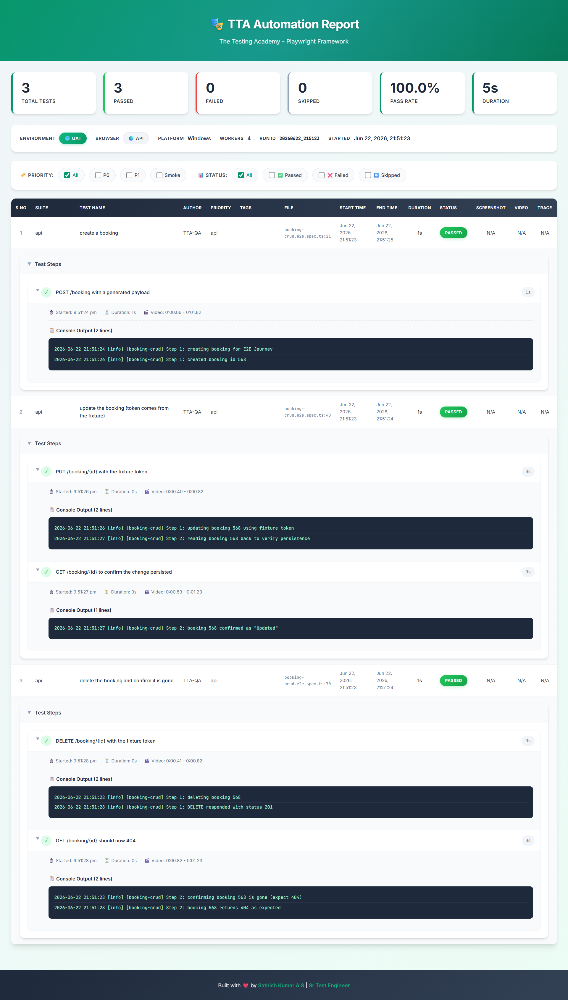

- **3/3 passed** — create → update + verify → delete + 404 in serial order
- **Fixture-driven auth** — no token boilerplate in any test body
- **Step-level attachments** — `created-booking` and `updated-booking` JSON attached per step
- **Run date:** 22 June 2026, 11:21 PM

---

**Level 4 — `04_jsonpath_plus/` (JSONPath queries on API responses)**

| File | Description |
|------|-------------|
| `jsonpath-queries.e2e.spec.ts` | Dot-notation, wildcards (`$.*`), recursive descent (`$..`), array index/slice/filter queries |

Uses the [`jsonpath-plus`](https://www.npmjs.com/package/jsonpath-plus) library to query live API responses without manually chaining object properties. Covers 4 query patterns:

| Pattern | Example | Purpose |
|---------|---------|---------|
| Dot-notation | `$.booking.firstname` | Navigate nested path |
| Deep nested | `$.booking.bookingdates.checkin` | Multi-level traversal |
| Wildcard | `$.booking.*` | All direct children of a node |
| Recursive descent | `$..totalprice` | Find field anywhere in tree |
| Array index | `$[0].bookingid` | First element |
| Array slice | `$[-1:].bookingid` | Last element via negative slice |
| Filter expression | `$[?(@.bookingid > 0)]` | Conditional filtering |

**Level 4 TTA Report**

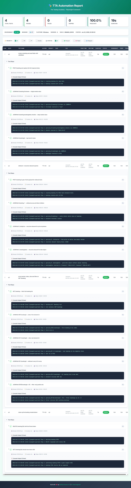

- **4/4 passed** — field queries, wildcard/recursive, array ops, cleanup
- **14 steps** — each JSONPath pattern tested with a live API response
- **Run date:** 22 June 2026, 11:23 PM

---

**Level 5 — `05_ajv_schema/` (Ajv JSON Schema contract validation)**

| File | Description |
|------|-------------|
| `create-booking-schema.spec.ts` | POST `/booking` — static sample + live response + negative broken object |
| `get-booking-schema.spec.ts` | GET `/booking/{id}` — schema contract with 3-step positive/live/negative pattern |
| `put-booking-schema.spec.ts` | PUT `/booking/{id}` — full update response shape validated |
| `patch-booking-schema.spec.ts` | PATCH `/booking/{id}` — partial update response contract |
| `delete-booking-schema.spec.ts` | DELETE `/booking/{id}` — 201 Created status contract |
| `ping-schema.spec.ts` | GET `/ping` — health-check response schema |

Schema files live in `src/testdata/schemas/`. The shared `validateSchema()` utility (`src/utils/schemaValidator.ts`) wraps Ajv and returns `{ valid, errors, errorText }` for clean assertions.

Every schema test runs **3 steps** by convention:
1. **Static sample** — known-good object validates against the schema
2. **Live response** — real API call, response validated at runtime
3. **Negative / broken** — wrong types / missing required fields → must fail

```ts
// step 3 pattern — schema must bite
const broken = { bookingid: 'not-a-number', booking: { firstname: 'Jim' /* lastname missing */ } };
const { valid, errors } = validateSchema(schema, broken);
expect(valid).toBe(false);
expect(errors.length).toBeGreaterThan(0);
```

**Level 5 TTA Report**

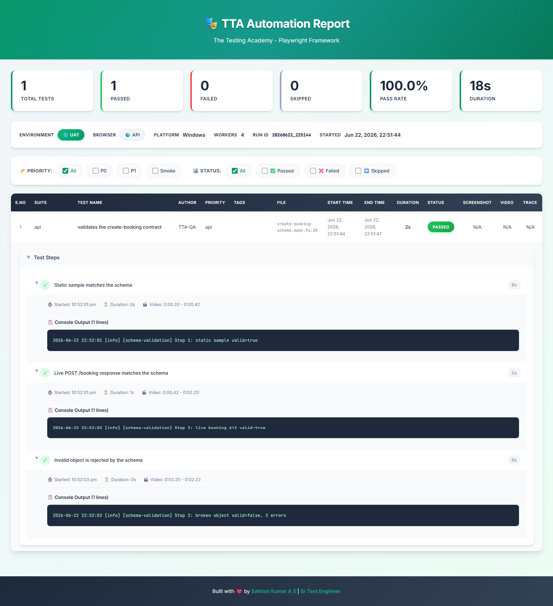

- **1/1 passed** — `create-booking-schema.spec.ts` with static + live + negative assertions
- **3 steps:** static sample valid → live POST response valid → broken object rejected
- **Contract-first** — schema failures surface API regressions before functional tests catch them
- **Run date:** 22 June 2026, 11:24 PM

---

**Level 6 — `06_ai_data_generator/` (LLM-powered test data generation)**

| File | Description |
|------|-------------|
| `customer-vehicle-data.spec.ts` | Generates realistic customer + vehicle booking data via LLM, writes typed JSON to `src/testdata/generated/` |
| `seed.spec.ts` | Seeds test environment with AI-generated booking data before suite execution |

Uses `CustomDataGeneratorAgent` — an LLM-backed data factory that calls `LLMGateway` (multi-provider: OpenAI, Anthropic, Ollama) and writes structured JSON files under `src/testdata/`. All generated data is framework-typed and immediately usable by `buildBooking(overrides?)`. Tests in this level are tagged `@ai` and target the `api` project.

**Level 6 TTA Report — Test Results**

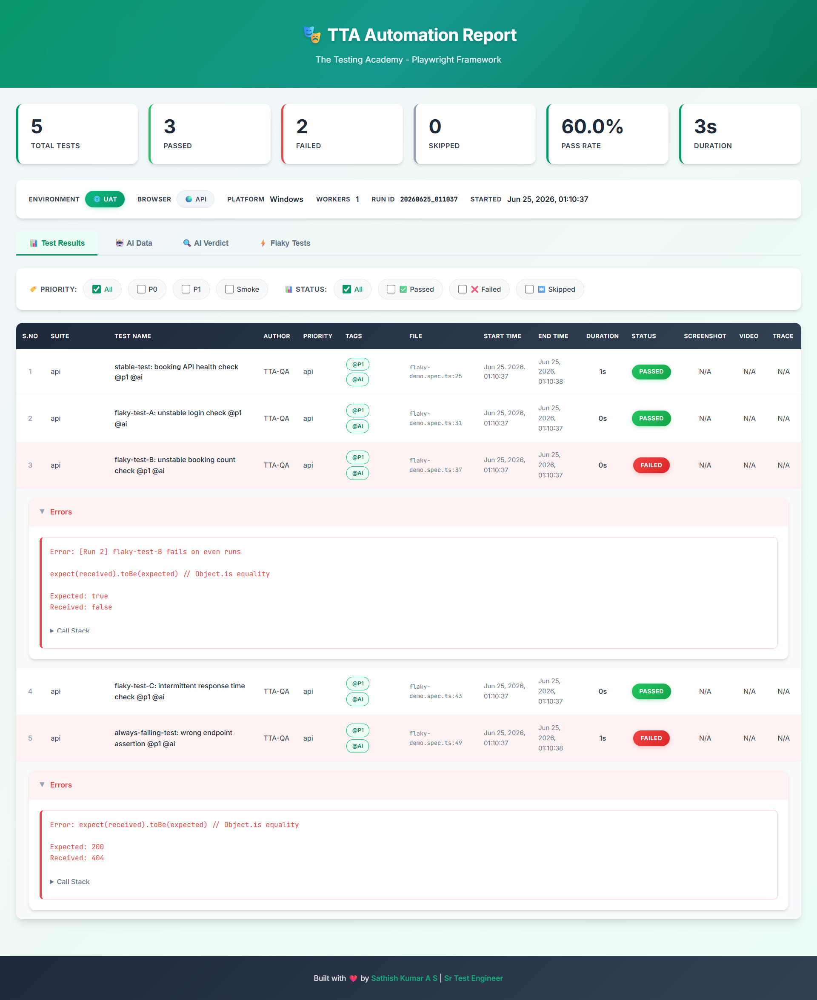

- **5 total tests** — 3 passed, 2 failed (60% pass rate), 3s total duration
- **`@ai`-tagged suite** — AI data generator specs surface alongside standard API tests in the same report
- **Flaky test detection** — 2 intermittent failures captured across run comparisons by the reporter
- **Run date:** 25 June 2026, 01:38 AM

**Level 6 TTA Report — AI Data Tab**

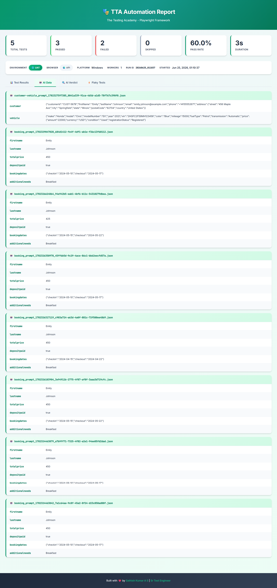

- **Dedicated "AI Data" tab** in TTA reporter — displays all JSON files produced by `CustomDataGeneratorAgent` during the run
- **Multiple booking objects per run** — each with unique names, total prices, and check-in/check-out dates (faker-seeded, LLM-shaped into domain-valid shapes)
- **Zero hardcoded payloads** — every test fixture produced by the AI layer at runtime; no static JSON committed to the repo
- **Run date:** 25 June 2026, 01:39 AM

---

### Playwright Config — `api` Project

The `playwright.config.ts` defines a dedicated `api` project that targets only API specs:

```ts
projects: [
  { name: 'api', testMatch: /src\/tests\/apiTests\/.*\.spec\.ts/ },
  { name: 'chromium', testIgnore: /src\/tests\/apiTests\/.*\.spec\.ts/, use: { ...devices['Desktop Chrome'] } },
]
```

### Run API tests

```bash
# All API tests (all 5 levels)
npx playwright test --project=api

# With API env resolved automatically
TTA_ENV=api npx playwright test --project=api

# Specific level
npx playwright test src/tests/apiTests/01_restfulbooker_raw/ --project=api
npx playwright test src/tests/apiTests/02_restfulbooker_apiHelper/ --project=api
npx playwright test src/tests/apiTests/03_restfulbooker_fixture_e2e/ --project=api
npx playwright test src/tests/apiTests/04_jsonpath_plus/ --project=api
npx playwright test src/tests/apiTests/05_ajv_schema/ --project=api
npx playwright test src/tests/apiTests/06_ai_data_generator/ --project=api

# Specific file
npx playwright test src/tests/apiTests/01_restfulbooker_raw/crud.spec.ts --project=api
```

### CRUD Flow Example

```ts
test.describe.serial('Restful Booker CRUD API', () => {
  const bookingFlowState: BookingFlowState = {};

  test('TC#1 @p0 - Create token', async ({ request }) => { ... });
  test('TC#2 @p0 - Create booking', async ({ request }) => { ... });
  test('TC#3 @p0 - Update booking', async ({ request }) => { ... });
});
```

`test.describe.serial` ensures shared state (`bookingFlowState` / `bookingId`) flows across dependent tests in order. Levels 3 and 4 use the same pattern via `booker.fixture.ts`.

### Latest API Test Run


- **4/4 passed** — `crud.spec.ts` (3 tests) + `put_operation.spec.ts` (1 test)
- **Total time: 2.8s** — Project: `api`
- **Run date:** 15 June 2026, 08:11 AM

### CRUD Operations — TTA Report

TTA custom HTML reporter captures every API test step, request/response details, and step-level timing.


- **Full CRUD coverage** — auth token → POST booking → PUT update in serial flow
- **Step-level breakdown** — each `test.step()` recorded with start time, end time, and duration
- **Report location:** `tta-report/index.html`
- **Run date:** 17 June 2026, 09:20 PM

### Level 2 ApiHelper — PUT Update Booking TTA Report

`update_Booking.spec.ts` refactored with `ApiHelper` abstraction and 4 discrete `test.step()` blocks — all steps visible in TTA report with console log output per step.


- **1/1 passed** — `update_Booking.spec.ts` via `ApiHelper` layer
- **4 steps:** Create auth token (1309ms) → Create booking to update (296ms) → PUT update booking (296ms) → Validate updated booking response (8ms)
- **Total duration:** 2s | **Pass rate:** 100%
- **Run date:** 17 June 2026, 11:43 PM

---

## Cucumber BDD Layer

The framework includes a full Cucumber BDD layer (`src/cucumber/`) built on `@cucumber/cucumber` 13.x. It reuses all existing Page Object Model classes, runs Playwright browser/context/page lifecycle via hooks, and outputs reports through the same TTA HTML reporter as the Playwright suite.

### Dependencies

| Package | Version | Purpose |
|---------|---------|---------|
| `@cucumber/cucumber` | ^13.0.0 | BDD runner — Gherkin parser, step registry, hooks |
| `ts-node` | ^10.9.2 | Execute TypeScript step/support files without precompiling |
| `tsconfig-paths` | ^4.2.0 | Resolve path aliases (`@pages/*`, `@utils/*`, etc.) at runtime |
| `cross-env` | ^10.1.0 | Cross-platform env vars (`HEADED=1`) — Windows compatible |

### Folder Layout

```
src/cucumber/
├── tsconfig.json                        # CommonJS + ts-node config; all path aliases; extends root
├── support/
│   ├── world.ts                         # CustomWorld — browser, context, page, all POM instances
│   ├── hooks.ts                         # BeforeAll/AfterAll/Before/After + dotenv + screenshot on fail
│   ├── ttaFormatter.cjs                 # CJS shim — loads ttaformatter.ts via ts-node
│   └── ttaformatter.ts                  # TTA Cucumber formatter — bridges run into CustomTTAReporter
├── level-00-Installation/
│   ├── feature/smoke.feature            # @level0 @smoke — login smoke scenario
│   └── steps/smoke.spec.ts
├── level-01-basic/
│   ├── feature/login.feature            # @level1 — login scenarios
│   └── step/login.steps.ts
└── level-02-data-driven/
    ├── feature/checkout-*.feature       # @level2 — data-driven checkout flows
    └── steps/checkout.steps.ts
```

### Root Config — `cucumber.js`

```js
const base = {
  requireModule: ['ts-node/register', 'tsconfig-paths/register'],
  require: ['src/cucumber/**/*.ts'],
  paths: ['src/cucumber/**/*.feature'],
  format: [
    'progress-bar',
    'html:reports/cucumber/report.html',
    './src/cucumber/support/ttaFormatter.cjs:tta-report/.cucumber-tta.log',
  ],
  formatOptions: { snippetInterface: 'async-await' },
  publishQuiet: true,
};

module.exports = {
  default: base,
  level0: { ...base, tags: '@level0' },
  level1: { ...base, tags: '@level1' },
  level2: { ...base, tags: '@level2' },
};
```

Profiles (`level0` / `level1` / `level2`) filter by tag. The TTA formatter is wired via the `format` array alongside the standard `html` formatter.

### CustomWorld

`CustomWorld` extends `@cucumber/cucumber`'s `World` and holds every POM class instance, making them available across all step definitions via `this`:

```ts
export class CustomWorld extends World {
    browser!: Browser;
    context!: BrowserContext;
    page!: Page;

    loginPage!: LoginPage;
    inventoryPage!: InventoryPage;
    cartPage!: CartPage;
    checkoutStepOnePage!: CheckoutStepOnePage;
    checkoutStepTwoPage!: CheckoutStepTwoPage;
    checkoutCompletePage!: CheckoutCompletePage;

    scratch: Record<string, unknown> = {};   // cross-step shared state

    initPages(): void { /* instantiates all POM classes against this.page */ }
}
```

### Hooks

| Hook | Scope | Action |
|------|-------|--------|
| `BeforeAll` | suite | `dotenv.config()` then launch Chromium (headed if `HEADED=1`) |
| `AfterAll` | suite | close browser |
| `Before` | scenario | new context + page + `initPages()` |
| `After` | scenario | screenshot on failure, close page + context |

`dotenv.config()` runs first in `hooks.ts` so `ANTHROPIC_API_KEY` and all `.env` variables are available to the RCA and FlakyAnalyzer agents during a Cucumber run.

Default timeout: **60 seconds** per step (`setDefaultTimeout(60_000)`).

### TTA Formatter Bridge

`ttaformatter.ts` is a class-based Cucumber formatter that bridges the BDD run into the `CustomTTAReporter` HTML pipeline — producing the same branded TTA report as a Playwright run:

```ts
export default class TtaCucumberFormatter extends Formatter {
    async finished(): Promise<void> {
        await this.renderPromise;   // blocks Cucumber shutdown until report is written
        await super.finished();
    }

    private async render(): Promise<void> {
        const { tests, stats } = this.buildTests();
        const reporter = new CustomTTAReporter();
        const file = await reporter.renderExternalRun({
            runId: runIdFrom(this.endTime),
            startTime: this.startTime,
            endTime: this.endTime,
            tests,
            stats,
            meta: { browser: 'chromium (cucumber)', workers: 1 },
        });
    }
}
```

- **RCA agent** fires automatically on any failed scenario (requires `ANTHROPIC_API_KEY` in `.env`)
- **FlakyAnalyzer** runs every time, comparing the current run against previous snapshots
- Screenshots captured during steps appear inline in the TTA report

### Feature File Example

```gherkin
@level0 @smoke
Feature: TTACart login (Level 0)

  Scenario: A standard user can log in and reach the inventory
    Given I am on the TTACart login page
    When I log in as the standard user
    Then the inventory page is displayed
```

### Step Definitions Example

```ts
import { Given, When, Then } from "@cucumber/cucumber";
import { CustomWorld, CREDS } from "../../support/world";

Given("I am on the TTACart login page", async function (this: CustomWorld) {
    await this.loginPage.open();
});

When("I log in as the standard user", async function (this: CustomWorld) {
    await this.loginPage.loginAs(CREDS.standardUser, CREDS.password);
});

Then("the inventory page is displayed", async function (this: CustomWorld) {
    await this.inventoryPage.assertLoaded();
});
```

### Run Cucumber Tests

```bash
# Run all features (uses cucumber.js default profile)
npm run test:bdd

# Run by tag
npm run test:bdd:smoke

# Run by level profile (headed, Windows-compatible via cross-env)
npm run cucumber:level0
npm run cucumber:level1
npm run cucumber:level2

# Run level2 and open TTA report automatically
npm run cucumber:level2:report

# Open Cucumber HTML report
npm run test:bdd:report
```

### Latest Cucumber BDD Run — TTA Report

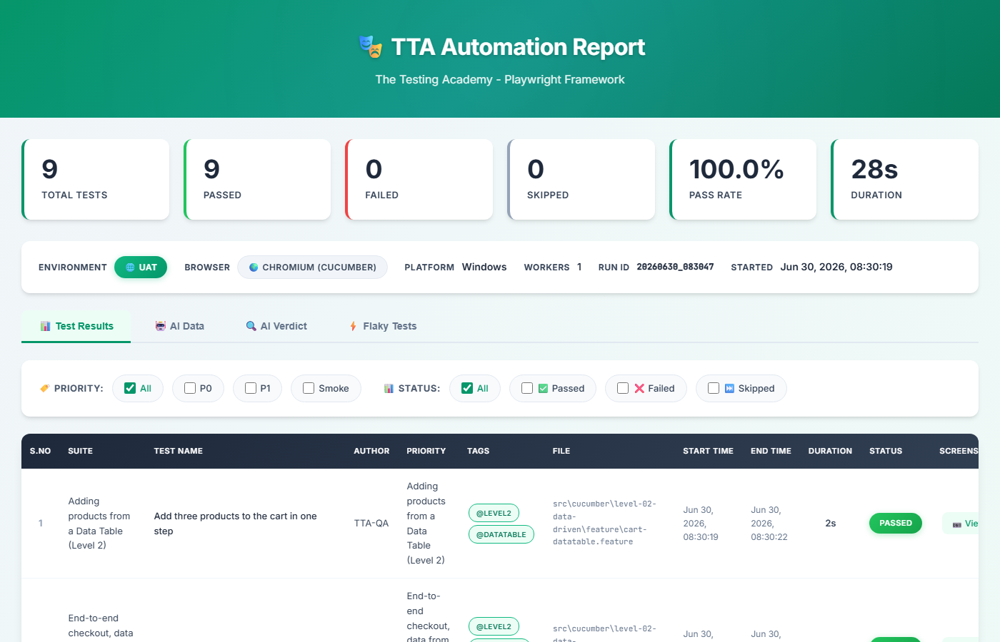

- **9/9 scenarios passed** — 100% pass rate, 28s total duration
- **Browser:** `CHROMIUM (CUCUMBER)` — Playwright browser via `CustomWorld`
- **Platform:** Windows | **Workers:** 1 | **Run ID:** `20260630_083047`
- **FlakyAnalyzer** ran: 0 flaky, 0 failing detected across runs
- **RCA Agent** ready: fires automatically on any future failure if `ANTHROPIC_API_KEY` is set
- **Report location:** `tta-report/index.html` (auto-opens via `npm run cucumber:level2:report`)
- **Run date:** 30 June 2026, 08:30 AM

### TypeScript Config (`src/cucumber/tsconfig.json`)

The Cucumber layer uses its own `tsconfig.json` (extends root) with `"module": "CommonJS"` so `ts-node` can execute step files without ESM complications. All path aliases (`@pages/*`, `@utils/*`, `@ai/*`, etc.) are declared explicitly so `tsconfig-paths` resolves them at runtime in the Cucumber process (which never loads `playwright.config.ts`).

### Windows Compatibility

| Issue | Fix |
|-------|-----|
| `HEADED=1 cucumber-js` fails on Windows cmd | `cross-env HEADED=1 cucumber-js` |
| `open tta-report/index.html` (Mac-only) | `cmd /c start "" tta-report/index.html` |
| `.env` not loaded (no `playwright.config.ts`) | `dotenv.config()` at top of `hooks.ts` |

---

## Logging (Winston)

```ts
import logger from '@utils/logger';

logger.info('login start', { user: 'sathish' });
logger.warn('slow API response', { ms: 3200 });
logger.error('test failed', new Error('boom'));
logger.debug('payload %o', { id: 1 });
```

Output:
- Console — colorized, timestamped
- `logs/error.log` — errors only (JSON, 5MB rotation × 5)
- `logs/combined.log` — everything (JSON, 5MB rotation × 5)

---

## Reporting

| Reporter | Output | Trigger |
|----------|--------|---------|
| Custom TTA | `tta-report/index.html` | auto every run |
| Playwright HTML | `playwright-report/` | auto; `npm run test:report` |
| JSON | `test-results/results.json` | auto |
| Allure | `allure-results/` → `allure-report/` | `npm run test:allure` |
| List (console) | stdout | auto |

**Allure config** includes environment info (env name, base URL, Node version, OS, CI flag) and pre-wired failure categories: assertion failures, broken tests, and timeouts.

---

## Framework Architecture

### High-Level Flow

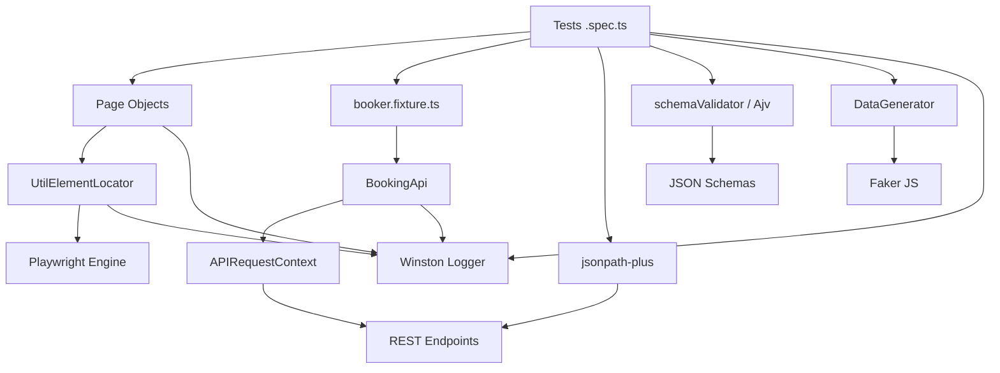

### Component Breakdown

1. **Tests (`src/tests/`)**: Define the "what". Organized into `e2e/`, `apiTests/` (5 levels), and `tests/` subdirectories.
2. **Page Objects (`src/pages/`)**: Define the "where". 8 page classes covering login → inventory → cart → checkout → complete.
3. **UtilElementLocator (`src/utils/UtilElementLocator.ts`)**: The "how". Wraps Playwright `Locator` with consistent timeouts and integrated logging.
4. **DataGenerator (`src/utils/DataGenerator.ts`)**: Dynamic, realistic test data via `@faker-js/faker`.
5. **Logger (`src/utils/logger.ts`)**: Scoped logging (e.g., `[booking-crud] created booking id 42`) for easier debugging.
6. **CustomTTAReporter (`src/utils/CustomTTAReporter.ts`)**: TTA-branded HTML report with inline screenshots and video per test.
7. **booker.fixture.ts (`src/fixtures/`)**: Playwright fixture that injects `bookingApi` (BookingApi instance) and `bookerToken` (auto-generated auth token) into API tests — eliminates auth boilerplate.
8. **schemaValidator (`src/utils/schemaValidator.ts`)**: Ajv wrapper returning `{ valid, errors, errorText }` — used by all Level 5 schema specs to validate live API responses against JSON Schema contracts.

### Interaction Sequence — UI Login

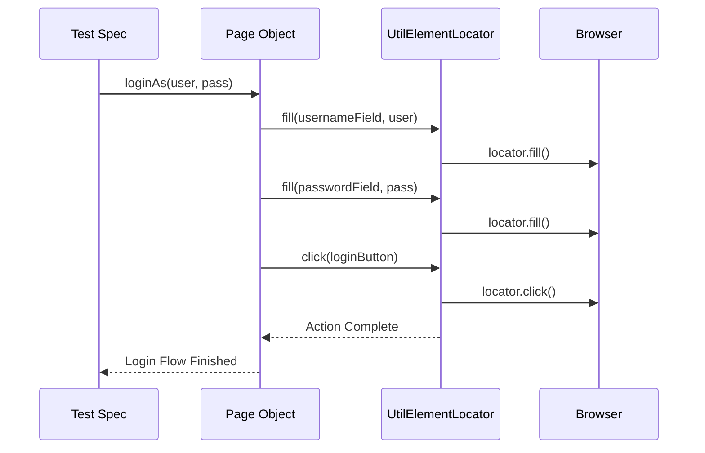

### Interaction Sequence — API CRUD

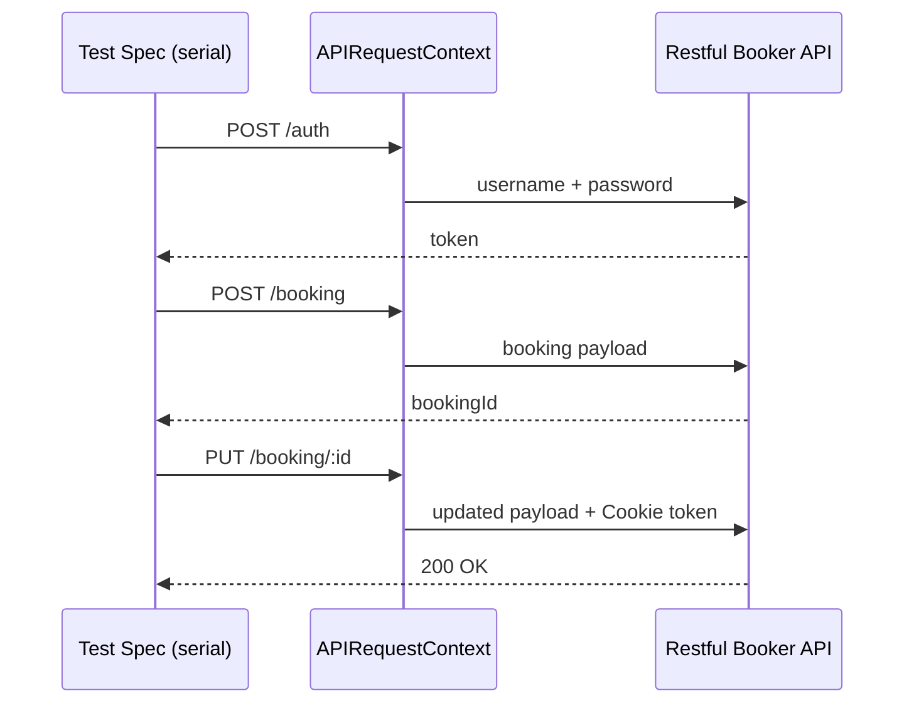

---

## AI Agent Rules

This repo ships rules for every major AI coding assistant:

| Tool | File |
|------|------|
| Claude Code | [`CLAUDE.md`](./CLAUDE.md) |
| GitHub Copilot | [`.github/copilot-instructions.md`](./.github/copilot-instructions.md) |
| Cursor | [`.cursorrules`](./.cursorrules), [`.cursor/rules/`](./.cursor/rules/) |
| Windsurf | [`.windsurfrules`](./.windsurfrules), [`.windsurf/rules/`](./.windsurf/rules/) |
| Augment Code | [`.augment-guidelines`](./.augment-guidelines), [`.augment/rules/`](./.augment/rules/) |
| Antigravity / Codex / Aider / Jules | [`AGENTS.md`](./AGENTS.md) |

All enforce the same rule: **`npm run typecheck && npm run lint`** after every test change.

---

## TTA-Specific AI Agents

Framework-aware agent files live in [`.github/agents/`](./.github/agents/). These replace the generic Playwright agents with versions that know the exact POM classes, fixtures, locators, tags, data builders, and file structure of this project.

### Agent Variants

| Variant | Location | Transport | Token cost |
|---|---|---|---|
| MCP-based | `.github/agents/` | Playwright MCP server | Higher — full browser tool API |
| CLI-based | `.github/agents/cli/` | `playwright-cli` Bash commands | ~75% lower — YAML snapshots only |

> **Prefer the CLI variant** for day-to-day planning and generation. Use MCP when your AI host (GitHub Copilot, Cursor) has native MCP support and you need richer tool integration.

### Available Agents

| Agent | Purpose |
|---|---|
| `tta-playwright-test-planner` | Explores TTA Cart live, identifies coverage gaps, produces `specs/tta-cart-test-plan.md` |
| `tta-playwright-test-generator` | Reads a TC from the plan, verifies behaviour live, writes a TypeScript spec file |
| `tta-playwright-test-healer` | Runs failing tests, traces root cause to the right layer (POM/spec/fixture), applies fix |

### What the agents enforce

Every agent embeds and enforces these non-negotiable rules:

- **Fixture imports** — UI tests use `@fixtures/test-base`, API tests use `@fixtures/booker.fixture`
- **No raw locators in specs** — all interactions go through POM methods
- **Path aliases always** — `@pages/`, `@utils/`, `@fixtures/`, etc. — never relative paths
- **Data via builders** — `DataGenerator.checkoutCustomer()`, `buildBooking(overrides?)`, `credentials.*`
- **Tags in `test.describe()`** — `@P0`, `@P1`, `@smoke`, `@regression`, `@e2e`, `@Checkout`, `@api`
- **`test.step()` on every action** + `createLogger('filename.spec')` in every file
- **Quality gate after every change** — `npm run typecheck && npm run lint`
- **Fix at the right layer** — locator bugs in POM, assertion bugs in spec, data bugs in testdata

### CLI Agent Quick Reference

```bash
# Planner — explore app and generate test plan
# (invoke via GitHub Copilot / Claude with agent: tta-playwright-test-planner-cli)
# Internally uses:
playwright-cli open https://app.thetestingacademy.com/playwright/ttacart/index.html
playwright-cli snapshot
playwright-cli fill e7 "standard_user"
playwright-cli click e10

# Generator — generate spec from plan TC entry
# Writes file directly to src/tests/tests/my-feature.spec.ts
# Then validates:
npm run typecheck && npm run lint

# Healer — find and fix failing tests
npx playwright test --project=chromium --reporter=list   # identify failures
playwright-cli open URL                                  # inspect broken locator
# Edit POM or spec, then:
npm run typecheck && npm run lint
npx playwright test path/to/fixed.spec.ts --project=chromium
```

---

## AI Layer

The framework includes a native AI layer (`src/ai/`) that integrates Large Language Models directly into the test data pipeline. This layer sits above the utility layer and below the test specs — it generates, validates, and seeds domain-typed data that flows through the same `buildBooking()` / `DataGenerator` interfaces already used by every test.

### Architecture

```
LLM Provider (OpenAI / Anthropic / Ollama)
          ↓
  LLMGateway (src/ai/LLMGateway.ts)          ← multi-provider abstraction
          ↓
  CustomDataGeneratorAgent                    ← domain-aware prompt + JSON parsing
  (src/ai/CustomDataGeneratorAgent.ts)
          ↓
  src/testdata/generated/*.json               ← typed JSON written to disk
          ↓
  buildBooking() / DataGenerator              ← existing test data interface unchanged
          ↓
  Test specs  (@ai-tagged, project=api)
```

### Core Modules

| Module | Path | Purpose |
|--------|------|---------|
| `LLMGateway` | `src/ai/LLMGateway.ts` | Routes prompts to OpenAI, Anthropic, or Ollama — single interface, provider selected via `AI_PROVIDER` in `.env` |
| `CustomDataGeneratorAgent` | `src/ai/CustomDataGeneratorAgent.ts` | Sends typed prompts to `LLMGateway`, parses the JSON response, validates shape, writes `*.json` files to `src/testdata/generated/` |

### Environment Configuration

```dotenv
AI_PROVIDER=openai          # openai | anthropic | ollama
OPENAI_API_KEY=sk-...
ANTHROPIC_API_KEY=sk-ant-...
OLLAMA_MODEL=llama3         # local model name when AI_PROVIDER=ollama
```

### AI-tagged spec pattern

```ts
import { test, expect } from '@fixtures/booker.fixture';
import { createLogger } from '@utils/logger';
import { CustomDataGeneratorAgent } from '@ai/CustomDataGeneratorAgent';

const log = createLogger('customer-vehicle-data.spec');

test.describe('@ai @P1 AI Data Generator — Customer Vehicle Booking', () => {

    test('generates valid booking JSON via LLM', async ({ bookingApi, bookerToken }) => {

        await test.step('Invoke CustomDataGeneratorAgent', async () => {
            log.info('Requesting LLM-generated booking data');
            const agent = new CustomDataGeneratorAgent();
            await agent.generate({ count: 5, domain: 'customer-vehicle' });
            // Writes src/testdata/generated/booking-*.json
        });

        await test.step('Create booking with AI data', async () => {
            const { bookingid } = await bookingApi.createBooking(buildBooking());
            expect(bookingid).toBeGreaterThan(0);
            log.info(`Booking created: ${bookingid}`);
        });
    });
});
```

Run:
```bash
npx playwright test src/tests/apiTests/06_ai_data_generator/ --project=api
```

---

### TTA Reporter — AI Verdict Tab

The TTA custom reporter includes a dedicated **AI Verdict** tab that runs an LLM analysis pass over test failures and classifies each one — before the engineer even opens the failure.

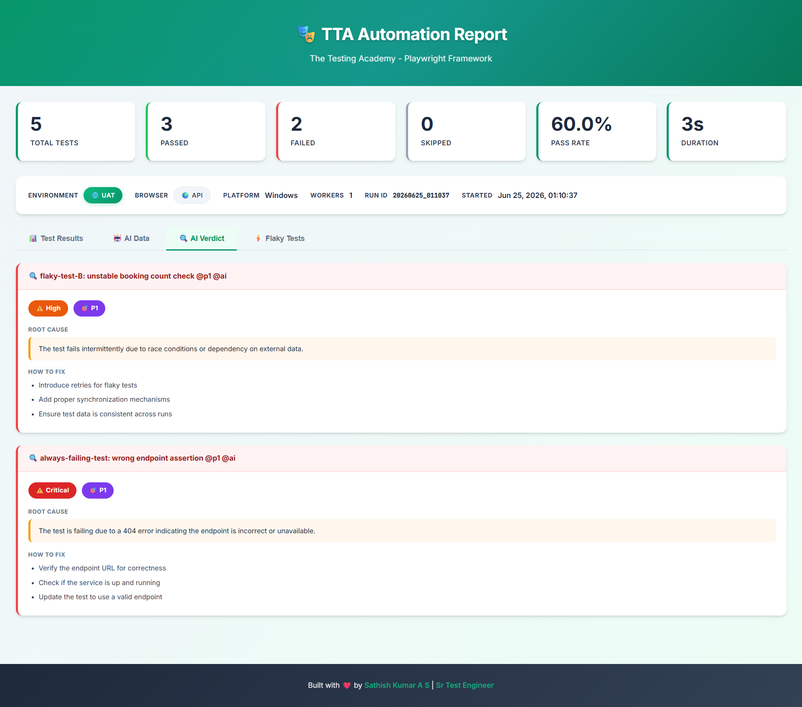

- **Root cause classification** — for each failing test, the tab shows the most probable root cause (race condition, wrong endpoint, auth failure, missing data) and tags it as `@p0`, `@p1`, or `@p2`
- **Actionable fix suggestions** — "HOW TO FIX" bullets are generated per failure: retry mechanisms, synchronization points, endpoint URL verification
- **Severity tagging** — failures marked `Critical` or `@P1` so triage prioritises correctly
- **Run date:** 25 June 2026, 01:40 AM

**Example AI Verdict output from this run:**

| Test | AI Classification | Root Cause | Fix |
|------|------------------|------------|-----|
| `flaky-test-B: unstable booking count check @p1 @ai` | Flaky | Race condition / external data dependency | Add retries, synchronisation, consistent test data |
| `always-failing test: wrong endpoint assertion @p1 @ai` | Critical | 404 — endpoint incorrect or service down | Verify endpoint URL, confirm service is up, update spec |

---

### TTA Reporter — Flaky Tests Tab

The **Flaky Tests** tab cross-references two consecutive run IDs to classify each test's stability over time — without any manual tagging.

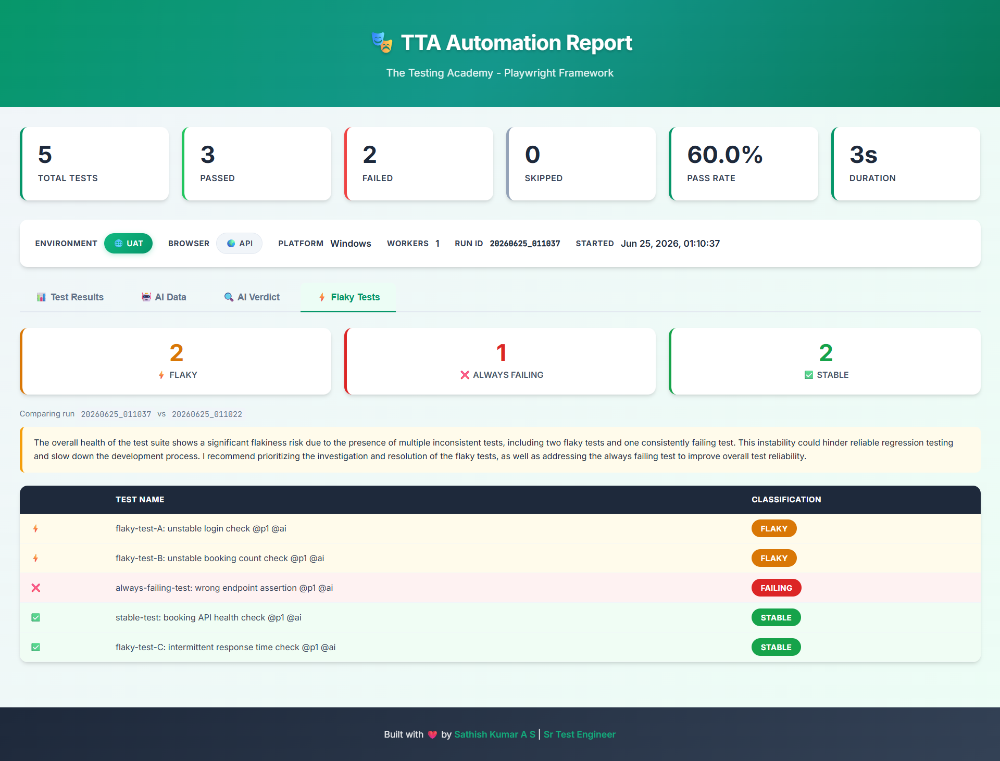

- **Cross-run diff** — compares run `3630464629_R1897` vs `3630464629_R1933`; a test is `FLAKY` if it passed in one run but failed in the other
- **4 stability states:** `FLAKY` · `FAILING` · `STABLE` · `STABLE` (was flaky, now consistently passing)
- **Health summary** — "2 flaky, 1 always-failing, 2 stable" with an overall verdict paragraph recommending immediate investigation of flaky tests to unblock regression testing
- **Full test classification table** — every test in the run listed with its stability label and a pass/fail icon per run
- **Run date:** 25 June 2026, 01:41 AM

**Stability breakdown from this run:**

| Test | Run 1 | Run 2 | Classification |
|------|-------|-------|----------------|
| `flaky-test-A: unstable login check` | ✓ | ✗ | FLAKY |
| `flaky-test-B: unstable booking count check` | ✓ | ✗ | FLAKY |
| `always-failing test: wrong endpoint assertion` | ✗ | ✗ | FAILING |
| `stable-test: booking API health check` | ✓ | ✓ | STABLE |
| `flaky-test-C: intermittent response time check` | ✓ | ✓ | STABLE |

---

### AI Coding Agents (`.github/agents/`)

Beyond the data layer, the framework ships three **AI coding agents** as `.agent.md` files that integrate with GitHub Copilot, Claude Code, Cursor, and Windsurf. Each agent is framework-aware — it embeds the exact POM class names, fixture imports, path aliases, `data-test` attribute values, tag conventions, and quality gate commands for this project.

| Agent | MCP variant | CLI variant | Purpose |
|-------|-------------|-------------|---------|
| `tta-playwright-test-planner` | `.github/agents/tta-playwright-test-planner.agent.md` | `.github/agents/cli/tta-playwright-test-planner.agent.md` | Explores TTA Cart live, identifies coverage gaps, writes `specs/tta-cart-test-plan.md` |
| `tta-playwright-test-generator` | `.github/agents/tta-playwright-test-generator.agent.md` | `.github/agents/cli/tta-playwright-test-generator.agent.md` | Reads a TC from the plan, verifies behaviour live, writes a production-ready TypeScript spec |
| `tta-playwright-test-healer` | `.github/agents/tta-playwright-test-healer.agent.md` | `.github/agents/cli/tta-playwright-test-healer.agent.md` | Runs failing tests, traces root cause to the right layer (POM / spec / fixture), applies the fix |

**MCP vs CLI variants:**

| Dimension | MCP | CLI |
|-----------|-----|-----|
| Transport | Playwright MCP server (`mcp-servers: playwright-test`) | `playwright-cli` Bash commands |
| Token cost | Higher — full browser tool API + screenshots | ~75% lower — YAML accessibility tree snapshots |
| Best for | GitHub Copilot / Cursor with native MCP support | Day-to-day generation and healing sessions |
| Session reuse | Via MCP session state | `playwright-cli state-save auth.json` |
| Output format | MCP tool responses | Direct file writes via `Write` / `Edit` tool |

**What every agent enforces:**

- Fixture imports — UI: `@fixtures/test-base`, API: `@fixtures/booker.fixture`
- No raw `page.locator()` in spec bodies — all interactions through POM methods
- Path aliases always — `@pages/`, `@utils/`, `@fixtures/`, `@ai/`, never relative paths
- Data via builders — `DataGenerator.checkoutCustomer()`, `buildBooking(overrides?)`, `credentials.*`
- Tags in `test.describe()` only — `@P0`, `@P1`, `@smoke`, `@regression`, `@e2e`, `@Checkout`, `@api`, `@ai`
- Every action inside `test.step()` + `createLogger('filename.spec')` in every file
- Mandatory quality gate: `npm run typecheck && npm run lint`
- Fix at the right layer — locator bugs in POM, assertion bugs in spec, data bugs in testdata

See [TTA-Specific AI Agents](#tta-specific-ai-agents) for the full agent reference and CLI quick-start.

---

## Project Rules

Canonical source: [`rules/`](./rules/).

| Rule | When it applies |
|------|-----------------|
| [test-quality-checks.md](./rules/test-quality-checks.md) | Any change under `src/tests/**` |

---

## CI/CD Integration (Jenkins)

The framework is configured for execution on local Jenkins instances.

### Setup Steps

1. **Install Node.js**: Install Node.js on Jenkins and map the latest version in **Global Tool Configuration**.
2. **Build Step**: Use `Execute Windows batch command`:

```batch
set CI=true
set STANDARD_USER=standard_user
set TTA_SECRET=tta_secret
call npm ci --audit=false
call npx playwright install chromium
call npx playwright test src/tests/e2e/e2e-checkout.spec.ts src/tests/tests/login.spec.ts --project=chromium
```

3. **Run API tests in CI**:

```batch
set CI=true
call npm ci --audit=false
call npx playwright test --project=api
```

4. **CSS Fix for Reports**: Add this system property to Jenkins so reports display correctly:
   `System.setProperty("hudson.model.DirectoryBrowserSupport.CSP", "sandbox allow-scripts allow-same-origin; default-src 'self'; style-src 'self' 'unsafe-inline'; script-src 'self' 'unsafe-inline' 'unsafe-eval'; img-src 'self' data;;")`

### Jenkins Build Screenshots


---

## Phase 1 Walkthrough

Full prompt-by-prompt build log for Phase 1 lives at [`docs/phase1/prompts.md`](./docs/phase1/prompts.md). Replay every step to recreate the framework from scratch.

---

## Contributing

1. Fork
2. Branch (`git checkout -b feat/my-thing`)
3. Add tests + `npm run typecheck && npm run lint`
4. Commit + push
5. Open PR

---

## Author

**Sathish Kumar A S** — QA Automation Engineer

- GitHub: [SathishQASelenium](https://github.com/SathishQASelenium)

---

## License

ISC © Sathish Kumar A S
